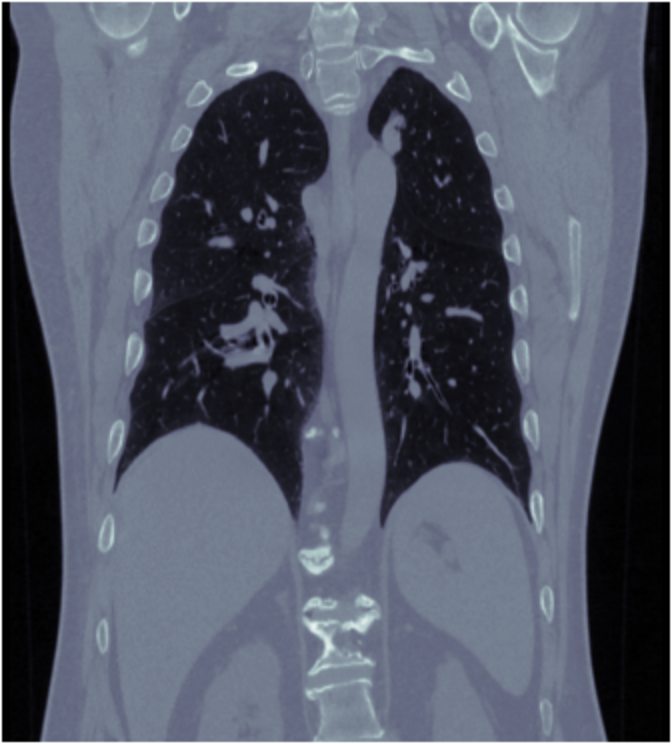
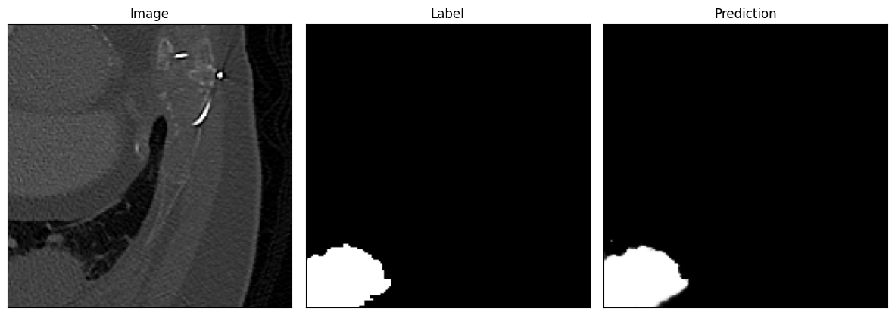
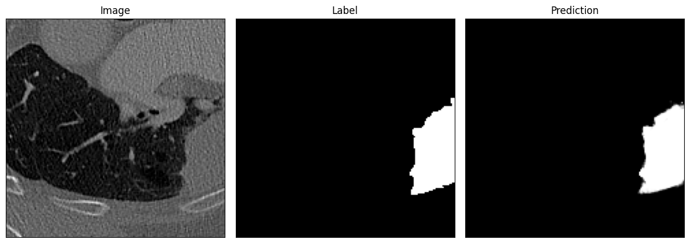

# Lung Cancer Auto-Segmentation

## Overview

This project focuses on the automatic segmentation of lung tumors from 3D MRI images. Lung MRI is an imaging technique that provides detailed images of lung tissues and is crucial in detecting abnormalities like tumors. The goal of this project is to accurately identify and delineate tumor regions within the volumetric data, a critical step in the diagnosis and treatment planning for lung cancer.

The project involves:

- **Extraction of subvolumes**: Generating smaller 3D patches on the base of original 3D data which include at least 1% of the tumor.
- **Generating a new dataset**: Creating a standardized dataset by generating 10,000 examples of subvolumes.
- **Initializing a 3D U-Net architecture**: This architecture allows capturing spatial context.
- **Model Evaluation**: Using dice coefficient as an evaluation metric that compares the overlap between predicted and ground truth regions

On the test set, the dice coefficient reaches 0.7959, the soft dice loss is 0.1663.

## Prediction

The images above show a comparison between the original MRI subvolume, the ground truth, and the model's prediction (the data is visualized along the middle of the 2nd dimension):

- **Left**: Original MRI slice
- **Middle**: Ground truth segmentation
- **Right**: Model prediction

## References

This code is inspired by the assignment **'Brain Tumor Auto-Segmentation for Magnetic Resonance Imaging (MRI)'** from the **AI for Medical Diagnosis** course, which is part of the **AI for Medicine Specialization**.
